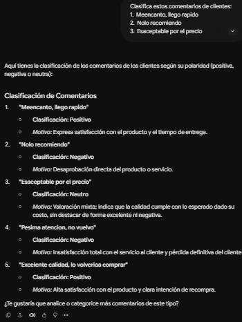
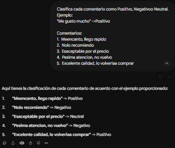
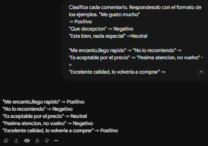
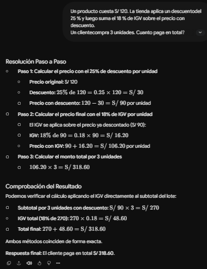
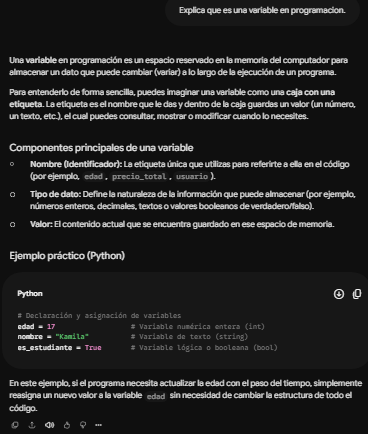
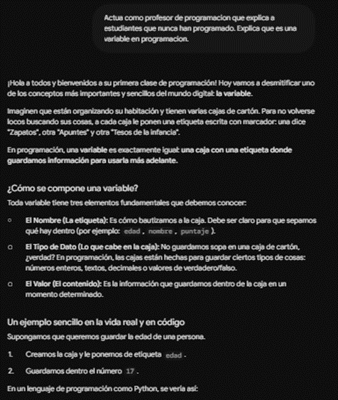
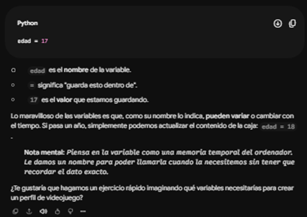
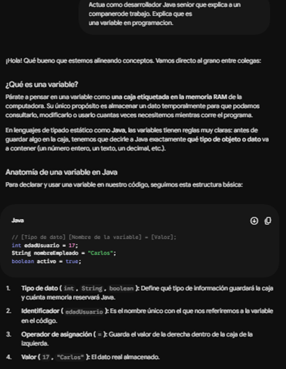
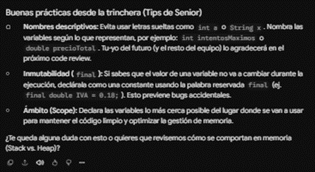

# Bitacora de tecnicas avanzadas

Laboratorio 07: Tecnicas Avanzadas de Prompting. Herramienta de IA usada: (escribe aqui cual usaste)


##	Ejercicio	2:	Zero-shot, one-shot y few-shot
| **Tipo** | **Aciertos (de 5)** | **Formato de la respuesta** | **Todas con el mismo formato (Si/No)** |
|---|---|---|---|
| **Zero-shot** | 5 | Libre y explicativo | No |
| **One-shot** | 5 | Estructura corta con flecha (`->`) | No |
| **Few-shot** | 5 | Estructura corta según ejemplos | No |

### 1. Zero-shot
```text
Prompt: 
Clasifica estos comentarios de clientes:
1.  Meencanto, llego rapido
2.  Nolo recomiendo
3.  Esaceptable por el precio
4.  Pesima atencion, no vuelvo
5.  Excelente calidad, lo volveriaa comprar
```



### 2. One-shot
```text
Prompt: 
Clasifica cada comentario como Positivo, Negativoo Neutral. Ejemplo:
"Me gusto mucho" ->Positivo
 
Comentarios:
1.  Meencanto, llego rapido
2.  Nolo recomiendo
3.  Esaceptable por el precio
4.  Pesima atencion, no vuelvo
5.  Excelente calidad, lo volveriaa comprar
```


### 3. Few-shot
```text
Prompt: 
Clasifica cada comentario. Respondesolo con el formato de los ejemplos. 
"Me gusto mucho" -> Positivo
"Que decepcion" -> Negativo
"Esta bien, nada especial" -> Neutral

"Me encanto, llego rapido" -> "No lo recomiendo" ->
"Es aceptable por el precio" -> "Pesima atencion, no vuelvo" ->
"Excelente calidad, lo volveria a comprar" ->

```



##	Ejercicio	3:	Chain of Thought

| **Pedido** | **Respuesta de la IA** | **Muestra los pasos (Sí/No)** | **Correcta (Sí/No)** |
|---|---|---|---|
| **Directo** | 318.60 | No | Sí |
| **Paso a paso** | Respuesta final: El cliente paga en total S/ 318.60. | Sí | Sí |

```Text
Es útil ver el razonamiento paso a paso porque nos permite verificar la exactitud de cada cálculo intermedio, asegurando que el resultado final sea correcto y facilitando la detección de errores.
```

#### Captura 1: Pedido directo


#### Captura 2: Pedido paso a paso



##	Ejercicio	4:	Role prompting

| **Versión** | **Vocabulario (sencillo/técnico)** | **Usa ejemplos o código** | **A quien le sirve más** |
|---|---|---|---|
| **A. Sin rol** | Técnico / Neutro | Código directo | Público general |
| **B. Rol docente** | Sencillo | Ejemplos cotidianos (cajas) | Estudiantes principiantes |
| **C. Rol senior** | Técnico avanzado | Código y arquitectura | Desarrolladores |

#### Captura 1: Versión A (Sin rol)


#### Captura 2: Versión B (Rol docente)


#### Captura 3: Versión C (Rol senior)




##	Ejercicio	5:	Descomposicion

### Desglose del Enfoque Paso a Paso

* **Paso 1 (Requisitos):** 
  * *Entregable:* 5 requisitos clave definidos (CRUD de productos, control de stock con alertas, transacciones, reportes y persistencia con JDBC).
  * *Comentario:* Delimitó el alcance funcional y técnico exacto del sistema.

* **Paso 2 (Diseño de clases):** 
  * *Entregable:* Estructura de 5 clases orientadas a objetos (`Producto`, `Transaccion`, `DetalleTransaccion`, `ConexionDB`, `ReporteService`) con atributos y tipos de datos en Java.
  * *Comentario:* Estableció la arquitectura y la relación lógica entre los datos.

* **Paso 3 (Código fuente):** 
  * *Entregable:* Código Java limpio de la clase `Producto` con encapsulamiento, atributos privados, constructores (vacío y con parámetros) y métodos getters/setters.
  * *Comentario:* Proveedor de código ejecutable estándar y funcional.

* **Paso 4 (Mejoras y optimización):** 
  * *Entregable:* Refactorización avanzada con 3 mejoras críticas: migración a `BigDecimal` para precisión monetaria, validaciones estrictas contra valores negativos y métodos universales (`toString`, `equals`, `hashCode`).
  * *Comentario:* Elevó el código a un estándar profesional y robusto.


### Cuadro Comparativo

| **Criterio** | **Pedido de Una Sola Vez** | **Pedido por Pasos (Descomposición)** |
| :--- | :--- | :--- |
| **Nivel de Detalle** | Superficial y genérico. | Profundo y estructurado por fases. |
| **Control y Auditoría** | Bloque cerrado sin opción de revisión previa. | Auditoría y validación paso a paso. |
| **Calidad del Código** | Estructuras básicas con margen de error. | Código limpio, modular y optimizado (`BigDecimal`). |
| **Coherencia Lógica** | Tiende a desconectar componentes. | Arquitectura sólida donde cada fase se conecta con la anterior. |


##	Ejercicio	6:	Prompt estructurado y autocritica

| **Qué revisar** | **Cumple (Sí / No)** |
| :--- | :--- |
| **¿Tiene las 4 columnas pedidas?** | Si |
| **¿Incluye el bloqueo después de 3 intentos?** | Si |
| **¿Incluye casos con campos vacíos?** | Si |
| **¿Indica qué casos agregó en la autocrítica?** | Si |
| **¿Hay algún caso repetido o que no tenga sentido?** | Si |

### Prompt estructurado 
```text
<rol>Actua como analista de pruebas de software.</rol>
<contexto>Login web con correo y contrasena. La cuenta se bloquea despues de 3 intentos fallidos.</contexto>
<tarea>Piensa paso a paso que puede fallar y escribe 6 casos de prueba.</tarea>
<formato>Tabla con las columnas: ID, escenario, datos de entrada, resultado esperado</formato>
```

### Mensaje de autocrítica utilizados
```text
Revisa tu tabla: faltan casos limite como campos vacios, correo sin @ o contrasena con espacios? Agrega los que falten e indica cuales agregaste.